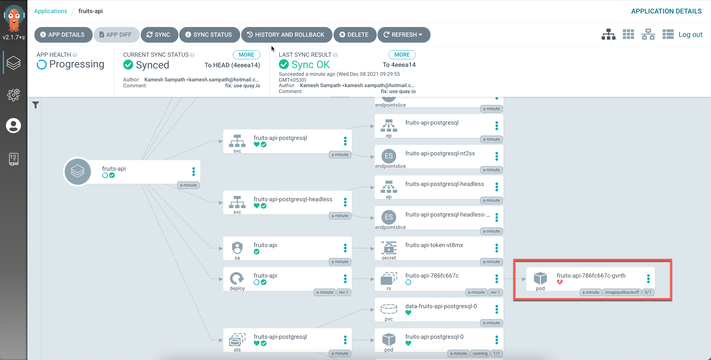
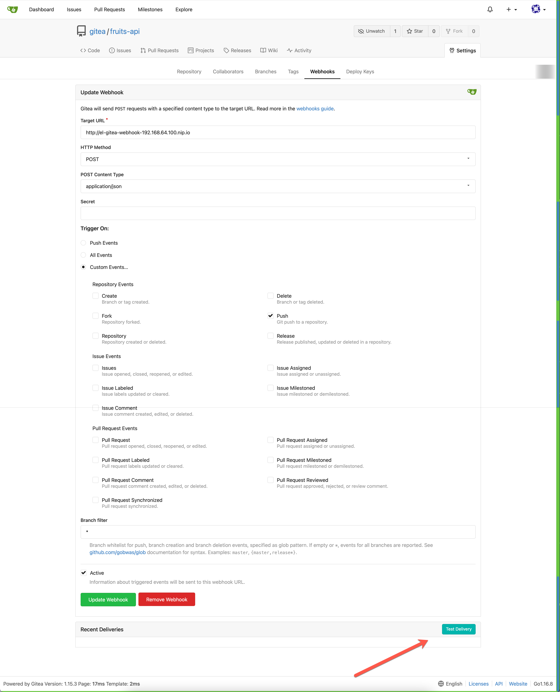
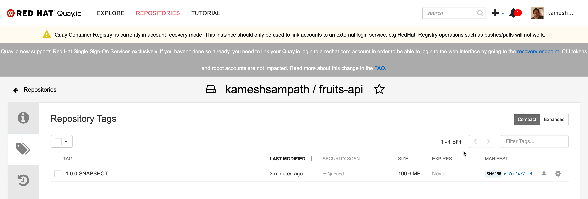
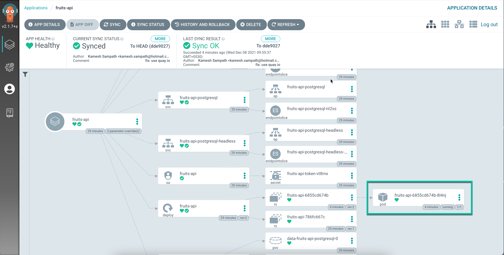
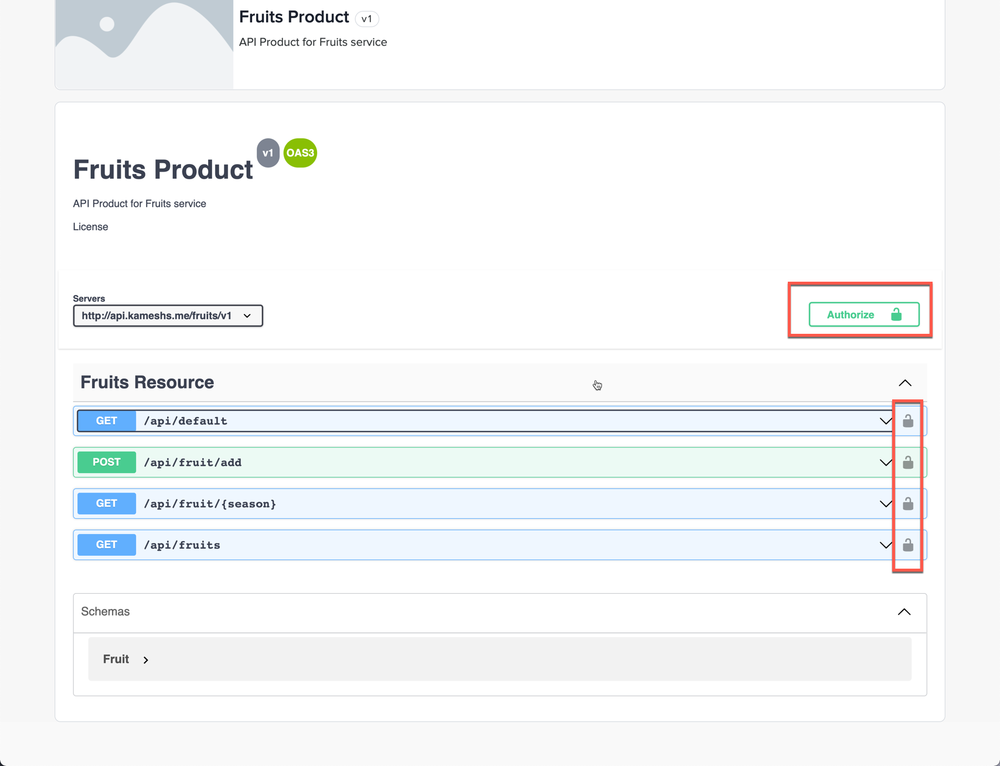

At the end of chapter you would have,

- [x] Deployed Tekton tasks and pipelines reuqired to build Fruits API
- [x] Deployed the Argocd Application to deploy Fruits API
- [x] Configure the Fruits API Webhook with Gitea

## Ensure Environment

---8<--- "includes/env.md"

## GitOps with Argocd and Tektoncd

As part of the demo we will be using [tektoncd](https://tekton.dev) to perform the **CI** part of building the container image and [argocd](https://argoproj.github.io) to do the **CD** part of synchnronizing the clusters using GitOps.

### Deploy Tektoncd Tasks

The following Tektoncd community tasks will be used by the FruitsAPI as part of the application build, since tektoncd does not install these out of the box we wil install them manually,

#### [maven](https://hub.tekton.dev/tekton/task/maven)

```shell
tkn hub install task maven \
  --version=0.2 \
  --context="$CLUSTER1"
```
  
#### [git-clone](https://hub.tekton.dev/tekton/task/git-clone)

```shell
tkn hub install task git-clone \
  --version=0.5 \
  --context="$CLUSTER1"
```

#### [buildah](https://hub.tekton.dev/tekton/task/buildah)

```shell
tkn hub install task buildah \
  --version=0.3 \
  --context="$CLUSTER1"
```

#### [openshift-client](https://hub.tekton.dev/tekton/task/openshift-client)

```shell
tkn hub install task openshift-client \
   --version=0.2 \
  --context="$CLUSTER1" 
```

### Create Tektoncd pipelines

As the pipelines will build and push the container image to [quay.io](https://quay.io) it is required to have the following two variables set in your environment,

```shell
export QUAYIO_USERNAME=<your github username>
```

```shell
export QUAYIO_PASSWORD=<your QUAY.io password/token>
```

Create the pipeline `fruits-api-deploy`,

```bash
kustomize build  pipelines \
  | envsubst \
  | kubectl apply --context $CLUSTER1 -f -
```

### Tekton Triggers

The Tekton Triggers take care of rebuilding the application as and when the new code is committed into the Git repository.

Get the gloo `gateway-proxy` LoadBalancer ip to configure the gloo routes and the same will be used to configure the Git Webhooks later,

```shell
export GLOO_GATEWAY_PROXY_IP="$(kubectl --context="$CLUSTER1" -n gloo-system  get svc gateway-proxy -ojsonpath='{.status.loadBalancer.ingress[*].ip}')"
```

Verify to see if it has value set,

```shell
echo "${GLOO_GATEWAY_PROXY_IP}"
```

Create Tekton Triggers that will run the image build once changes are pushed to fruits-api,

```bash
kustomize build triggers  \
  | envsubst | kubectl apply --context $CLUSTER1 -f -
```

Wait for the Gitea event listener webhook to be running,

```shell
kubectl --context=$CLUSTER1 \
  rollout status deploy/el-gitea-webhook --timeout=120s
```

The default Gitea credentials is `gitea/password`.

### Add Gitea Repository to Argocd

As the Gitea repository we will be using local and uses self signed certificates, let us configure that in Argocd to skip `sslVerify`,

Login to Argocd,

```shell
# make sure we are in mgmt kubernetes context
kubectl config use-context mgmt
argocd login --insecure \
  "$(yq e '.serviceUrl' $DEMO_WORK_DIR/argocd_details.yaml | cut -d'/' -f3 )" \
  --username "${ARGOCD_ADMIN_USERNAME}" \
  --password "${ARGOCD_ADMIN_PASSWORD}"
```

Add the local Gitea repository,

```shell
argocd repo add "$(yq e '.gitea_url' work/gitea_details.yaml)/${GITEA_USERNAME}/fruits-api-gitops.git" --username "${GITEA_USERNAME}" --password "${GITEA_PASSWORD}" --insecure-skip-server-verification
```

### Create Application

Query the `cluster1` info to get the cluster API URL and run the following command to create `fruits-api` ArgoCD application.

```bash
# Ensures colors are also removed form output
export TARGET_CLUSTER="$(kubectl --context="$CLUSTER1" cluster-info | sed 's/\x1b\[[0-9;]*m//g' | awk 'NR==1{print $7}')"
yq eval \
  '.spec.destination.server = strenv(TARGET_CLUSTER) | .spec.source.repoURL = strenv(FRUITS_API_GITOPS_REPO_URL)' \
  manifests/app/app.yaml \
  | kubectl --context="$MGMT" apply -n argocd -f - 
```

The Argocd application will apply the helm chart `$DEMO_HOME/charts/fruits-api using Helm values from $DEMO_HOME/helm_vars/fruits-api/values.yaml`.

The helm values supports by the chart are,

```yaml
---8<--- "charts/fruits-api/values.yaml"
```

Wait for few mins while argocd synchronizes the resource.

### Trigger Pipeline

Once you see the resources synchronized you will see the image pull backoff as the version of image `quay.io/kameshsampath/fruits-api:1.0.0` is not yet available in the repo.

{ align=center  }

Lets trigger the [pipeline](./pipelines/fruits-api-pipeline.yaml){ target=_blank }  to build and deploy the image to quay.io repository,

{ align=center  }

The [trigger](./triggers/fruits-api-trigger-template.yaml){ target=_blank } should have started a pipeline,

```shell
tkn pr --context="${CLUSTER1}" ls 
```

The command should show an output like,

```shell
NAME               STARTED          DURATION   STATUS
fruits-api-vqpbl   26 seconds ago   ---        Running
```

You can get the logs of the pipeline by,

```shell
tkn pr --context="${CLUSTER1}" logs -f <pipeline id form earlier command> 
```

e.g. `tkn pr --context="${CLUSTER1}" logs -f fruits-api-vqpbl`

!!!note
    * The pipeline *NAME* may vary in your setup
    * The first pipeline run will take time as it will cache maven artifacts to the nexus repository manager running in `cluster1`

The sucessful pipeline should push the image to quay.io.

{ align=center }

Wait for few mins before Argocd updates the deployment with the pushed image and show fruits-api pod running successfully.

{ align=center  }

### Routes

As we have already deployed the Gloo Edge, the service should have been auto discovered via Gloo. Let us run the following command to verify it,

```bash
kubectl --context="${CLUSTER1}" get upstream default-fruits-api-8080 \
  -n gloo-system -o yaml
```

Lets create route to access the API,

```shell
cat <<EOF | kubectl --context="${CLUSTER1}" apply -f - 
apiVersion: gateway.solo.io/v1
kind: VirtualService
metadata:
  name: fruits-api-http
  namespace: gloo-system
spec:
  virtualHost:
    domains:
      - fruits-api-${GLOO_GATEWAY_PROXY_IP}.nip.io
    routes:
      - matchers:
          - prefix: /
        routeAction:
          single:
            upstream:
              name: default-fruits-api-8080
              namespace: gloo-system
EOF
```

Now calling the service will return a list of fruits.

```shell
http "fruits-api-${GLOO_GATEWAY_PROXY_IP}.nip.io/api/fruits"
```

Lets delete the test route we have created as we will be using the Gloo Developer Portal to access the API.

```shell
kubectl --context="${CLUSTER1}" delete vs -n gloo-system fruits-api-http
```

## Portal

To enable porta edit and update the `$DEMO_HOME/helm_vars/fruits-api/values.yaml` **enablePortal** to **true**. Commit and push the code to git repository to see the Argocd synchronizing the application to create the new Gloo Portal resources,

```shell
yq -i e '.enablePortal=true' $DEMO_HOME/helm_vars/fruits-api/values.yaml
git commit $DEMO_HOME/helm_vars/fruits-api/values.yaml -m "Enable Portal"
git push dev main
```

Wait for Argocd to synchroize the commit, once the commit is synchronized you should see the following Gloo Portal resources created in the `default` namespace,

```shell
kubectl --context="${CLUSTER1}" get apidocs,apiproducts,portal,environment -oname
```

```shell
apidoc.portal.gloo.solo.io/fruits-api-apidoc-v1
apiproduct.portal.gloo.solo.io/fruits-api
portal.portal.gloo.solo.io/fruits-api
environment.portal.gloo.solo.io/fruits-api-dev
```

Now you can open the portal on your browser using the domain `http://portal.kameshs.me`

!!!tip
    Update your `/etc/hosts` as shown to allow accessing the portal using domain names
    ```shell
      192.168.64.100 api.kameshs.me api
      192.168.64.100 portal.kameshs.me portal
    ```
    Where `192.168.64.100` is the Gloo Gateway proxy address `$GLOO_GATEWAY_PROXY_IP`

### Enable Authentication

As you have observed by navigating to the `APIs` that all APIs are read only. 



To make the portal accessible we need to enable authentication.

To enable porta edit and update the `$DEMO_HOME/helm_vars/fruits-api/values.yaml` **enablePortal** to **true**. Commit and push the code to git repository to see the Argocd synchronizing the application to create the new Gloo Portal resources,

```shell
yq -i e '.enableRBAC=true' $DEMO_HOME/helm_vars/fruits-api/values.yaml
git commit $DEMO_HOME/helm_vars/fruits-api/values.yaml -m "Enable Portal RBAC"
git push dev main
```

Now hit the login button and try login to the portal using the user `dev1` and password `mysecurepassword`. Now when you check the APIs section it has the *Try out* option that allows you try the APIs.

When you try the API from CLI,

```shell
http api.kameshs.me/fruits/v1/api/fruits
```

You should see you are not authorized,

```text
HTTP/1.1 401 Unauthorized
content-length: 0
date: Wed, 08 Dec 2021 04:39:54 GMT
server: envoy
www-authenticate: API key is missing or invalid
```

The `enableRBAC` generates a default demo API key `Nzg4Y2VkODQtZTdlMS1mMzc0LWFhZGMtMGJjNDk4YmM5YTVl` that can be used to test the Authentication.

```shell
 http api.kameshs.me/fruits/v1/api/fruits "api-key: $API_KEY"
```

The API Key secret is stored in the `gloo-system` namespace, you can query it using the command:

```shell
kubectl --context=${CLUSTER1} get secrets -n gloo-system -lusageplans.portal.gloo.solo.io=basic -o yaml | yq e '.items[0].data["api-key"]' - | base64 -d
```

!!!tip
    You can also create API Key secret as shown below, make the note of annotations as they are key for Gloo to recognoize the annotation
    ```shell
    apiVersion: v1
    kind: Secret
    metadata:
      labels:
        apiproducts.portal.gloo.solo.io: fruits-product.default
        environments.portal.gloo.solo.io: dev.default
        usageplans.portal.gloo.solo.io: apikey
      name: fruits-apikey-test
      namespace: gloo-system
    type: extauth.solo.io/apikey
    stringData:
      api-key: Nzg4Y2VkODQtZTdlMS1mMzc0LWFhZGMtMGJjNDk4YmM5YTVl
      environment: dev
      plan: basic
      product: fruits-product.default
      username: dev1
    ```

### Monetization

Lets enable access to Admin console of the portal,

```shell
kubectl --context="${CLUSTER1}"  -n gloo-portal port-forward svc/gloo-portal-admin-server 8080
```

Open the DB Adminer via the browser,

```shell
export DB_ADMINER_IP=$(kubectl --context="${CLUSTER1}" get svc db-adminer -ojsonpath='{.status.loadBalancer.ingress[*].ip}')
```

Open the url `http://$(DB_ADMINER_IP):8080`, use the `Posygresql` as database with user id `postgres` and password `password`. Then run the following SQL command to create the *requests* tabl using the sql `/tmp/gloo-portal-db.sql`

Lets fire some requests to the API to generate the API calls graph,

```shell
for i in {1..5}; 
do 
  http api.kameshs.me/fruits/v1/api/fruits "api-key: $API_KEY"
done
```

As our API plan allows only three requests per minute, you will start to get **HTTP 429** after three requests,

```yaml hl_lines="23-25"
---8<--- "charts/fruits-api/templates/dev-environment.yaml"
```
